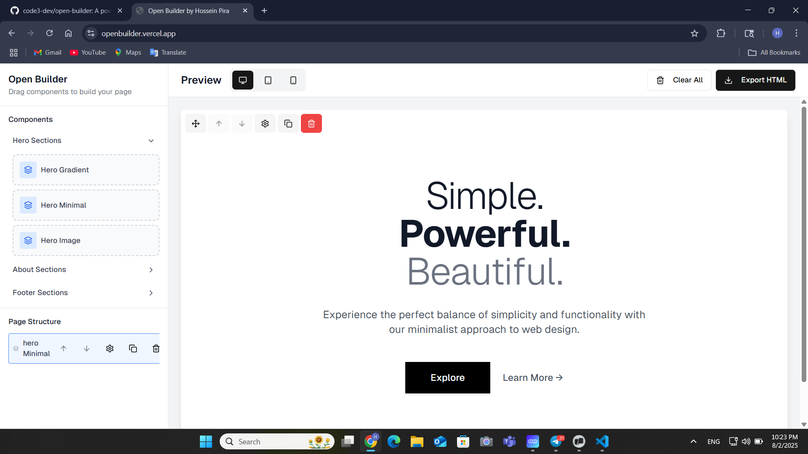

# Open Builder

**Open Builder by Hossein Pira** - A powerful, free and open-source visual website builder that allows you to create stunning web pages through an intuitive drag-and-drop interface.



## 🌟 Features

- **Visual Drag & Drop Interface**: Build websites by simply dragging components onto the canvas
- **Responsive Design**: Preview your designs across desktop, tablet, and mobile devices
- **Rich Component Library**: Pre-built components including:
  - Hero Sections (Gradient, Minimal, Image-based)
  - About Sections (Image+Text, Stats, Team)
  - Footer Sections (Simple, Newsletter, Social)
  - Basic Components (Cards, CTA, Feature highlights)
- **Real-time Editing**: Edit text, buttons, and component properties in real-time
- **Live Preview**: See your changes instantly with multiple device previews
- **HTML Export**: Export clean, production-ready HTML with Tailwind CSS
- **Property Panel**: Fine-tune component styles and properties
- **Mobile Restriction**: Desktop-first design approach with mobile optimization
- **Component Management**: Duplicate, delete, reorder, and organize components

## 🛠️ Tech Stack

- **Framework**: Next.js 15 with App Router
- **UI Components**: Radix UI + shadcn/ui
- **Styling**: Tailwind CSS with CSS Variables
- **Drag & Drop**: @hello-pangea/dnd
- **Icons**: Lucide React + Font Awesome
- **Fonts**: Geist Sans & Geist Mono
- **Type Safety**: TypeScript
- **Package Manager**: pnpm
- **Form Handling**: React Hook Form + Zod validation

## 🚀 Quick Start

### Prerequisites

- Node.js 20+ 
- pnpm (recommended) or npm

### Installation

1. **Clone the repository**
   ```bash
   git clone https://github.com/code3-dev/open-builder.git
   cd open-builder
   ```

2. **Install dependencies**
   ```bash
   pnpm install
   ```

3. **Start development server**
   ```bash
   pnpm dev
   ```

4. **Open your browser**
   Navigate to `http://localhost:3000`

## 📝 Available Scripts

- `pnpm dev` - Start development server
- `pnpm build` - Build for production
- `pnpm start` - Start production server
- `pnpm lint` - Run ESLint

## 🎨 Component Categories

### Navigation Components
- **Modern Navbar**: Full-featured navigation with logo, menu items, and CTA button
- **Minimal Navbar**: Clean, minimalist navigation design
- **Centered Navbar**: Logo-centered navigation with balanced layout
- **Sidebar Navbar**: Dashboard-style navigation with user profile and notifications

### Hero Sections
- **Gradient Hero**: Eye-catching gradient background with call-to-action buttons
- **Minimal Hero**: Clean, typography-focused design with elegant simplicity
- **Image Hero**: Background image with overlay, badge, and compelling content

### About Sections  
- **Image + Text**: Side-by-side layout with image and descriptive content
- **Stats**: Showcase key metrics and achievements with visual counters
- **Team**: Display team members with photos, roles, and bios

### Footer Sections
- **Simple Footer**: Basic footer with links, company info, and copyright
- **Newsletter Footer**: Footer with email subscription and organized links
- **Social Footer**: Footer with social media icons, contact info, and CTA

### Basic Components
- **Simple Cards**: Clean card layouts with icons, titles, and descriptions
- **CTA Sections**: Compelling call-to-action components with multiple buttons
- **Feature Highlights**: Showcase key features with icons and benefits
- **Testimonial Cards**: Customer testimonials with ratings and profile info
- **Pricing Cards**: Professional pricing plans with feature lists and CTAs
- **Contact Forms**: Complete contact forms with validation and styling
- **Image Gallery**: Responsive image galleries with hover effects
- **Video Sections**: Video showcases with thumbnails and play buttons
- **FAQ Sections**: Interactive FAQ components with expandable answers
- **Blog Cards**: Article previews with images, metadata, and read more buttons
- **Stats Counters**: Animated statistics displays with gradient backgrounds

## 🎯 Core Interfaces

```typescript
// Main component block structure
interface Block {
  id: string
  type: string
  content: string
  props?: Record<string, any>
  editableProps?: {
    texts?: Record<string, { content: string; styles: TextStyles }>
    buttons?: Record<string, { text: string; link: string; styles: ButtonStyles }>
    styles?: ComponentStyles
  }
}

// Typography styling options
interface TextStyles {
  fontSize: string
  fontFamily: string
  fontWeight: string
  // ... and more
}

// Button styling options  
interface ButtonStyles {
  backgroundColor: string
  textColor: string
  borderRadius: string
  // ... and more
}
```

## 🔧 Configuration

### Tailwind CSS
The project uses Tailwind CSS with custom CSS variables for theming. Configuration is in `tailwind.config.ts`.

### shadcn/ui
UI components are configured via `components.json` with custom aliases:
- `@/components` → components directory
- `@/lib` → utility functions  
- `@/hooks` → custom hooks

## 📱 Responsive Design

The builder includes responsive preview modes:
- **Desktop**: Full-width preview (default)
- **Tablet**: Tablet-optimized view
- **Mobile**: Mobile-optimized view

Mobile editing is restricted to ensure optimal user experience on larger screens.

## 🎪 Usage Guide

1. **Add Components**: Drag components from the sidebar to the canvas
2. **Edit Content**: Click on components to select and edit their properties
3. **Reorder**: Use drag & drop or arrow buttons to reorder components
4. **Preview**: Switch between device previews using the toolbar
5. **Export**: Generate clean HTML code ready for deployment

## 🚀 Deployment

### Build for Production
```bash
pnpm build
```

### Deploy to Vercel (Recommended)
```bash
# Install Vercel CLI
npm i -g vercel

# Deploy
vercel --prod
```

The project is optimized for Vercel deployment with proper configuration in `next.config.mjs`.

## 🤝 Contributing

1. Fork the repository
2. Create your feature branch (`git checkout -b feature/amazing-feature`)
3. Commit your changes (`git commit -m 'Add some amazing feature'`)
4. Push to the branch (`git push origin feature/amazing-feature`)
5. Open a Pull Request

## 📄 License

This project is licensed under the MIT License - see the [LICENSE](LICENSE) file for details.

## 👨‍💻 Author

- **Developer**: Hossein Pira
- **Telegram**: [@h3dev](https://t.me/h3dev)
- **Email**: h3dev.pira@gmail.com

## 🙏 Acknowledgments

- [Next.js](https://nextjs.org/) - The React framework for production
- [Tailwind CSS](https://tailwindcss.com/) - A utility-first CSS framework
- [Radix UI](https://www.radix-ui.com/) - Low-level UI primitives
- [shadcn/ui](https://ui.shadcn.com/) - Beautiful UI components
- [Lucide](https://lucide.dev/) - Beautiful & consistent icon toolkit

---

⭐ If you found this project helpful, please give it a star on GitHub!
